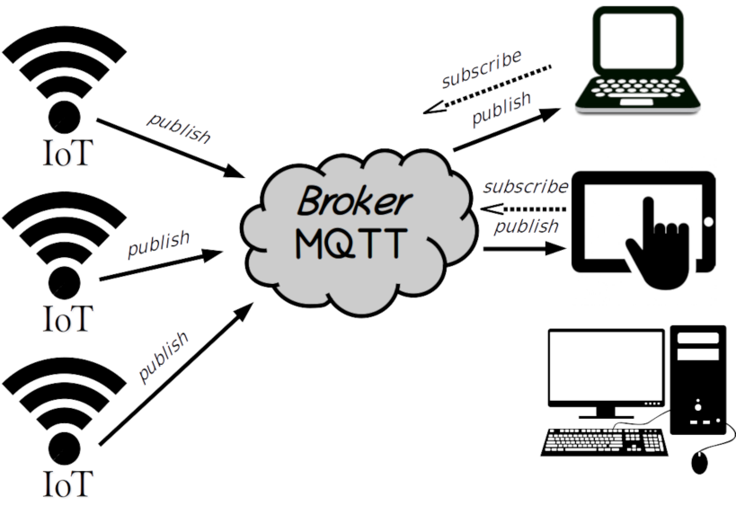

# protocole MQTT

## Introduction

MQTT (Message Queuing Telemetry Transport) est un protocole de messagerie publish-subscribe basé sur le protocole TCP/IP. 

liens:
[fr.wikipedia.org/wiki/MQTT](https://fr.wikipedia.org/wiki/MQTT)

[Documentation mosquitto](https://mosquitto.org/documentation/)


Présentation par HiveMQ:

- [Part 1](https://www.hivemq.com/blog/mqtt-essentials-part-1-introducing-mqtt/)
- [Part 2](https://www.hivemq.com/blog/mqtt-essentials-part2-publish-subscribe/)
- [Part 3](https://www.hivemq.com/blog/mqtt-essentials-part-3-client-broker-connection-establishment/)
- [Part 4](https://www.hivemq.com/blog/mqtt-essentials-part-4-mqtt-publish-subscribe-unsubscribe/)
- [Part 5](https://www.hivemq.com/blog/mqtt-essentials-part-5-mqtt-topics-best-practices/)


C’est maintenent un protocole utilisé dans le cadre de l’Internet des objets (IoT) et peut être considéré comme un protocole M2M (Machine-to-Machine).

Liens :

- [mqtt.org](https://mqtt.org/)
- [MQTT Wiki](https://github.com/mqtt/mqtt.org/wiki)
    Le protocole MQTT



MQTT offre une solution adaptée à une transmission de messages (proche d’un système de messagerie ou d’un bus logiciel comme D-BUS). Tous les acteurs se connectent à un élément central (le broker) et communiquent entre eux en envoyant (publish) des messages libellés avec un sujet et en souscrivant (subscribe) aux sujets qui les intéressent.

Les messages sont envoyés par des « publishers » sur un « topic » (canal de communication) à un « broker ». Ces messages peuvent être lus par des « subscribers » (abonnés). Les « topics » peuvent avoir une hiérarchie qui permettra de sélectionner les informations. Les « publishers » et « subscribers » sont considérés comme des « clients » 

Chaque message doit donc avoir un sujet associé (« topic »). Les sujets (« topic ») sont divisés en niveaux. Il y a des « wild-cards » (jokers) + et # :

capteurs/temperature/salon et capteurs/temperature/chambre capteurs/humidite/salon et capteurs/humidite/chambre

```
- + : sujet unique. Par exemple : a/+/c sera abonné à a/b/c et a/x/c.
- # : multi-sujets. Par exemple : a/# sera abonné à a/‹tout›
```

Le publisher définira l’option QoS dans les messages qui transitent via MQTT :

- QoS = 0 : le message sera délivré tout au plus une fois (« at most once ») sans garantie de réception et le message peut donc être perdu.
- QoS = 1 : le message sera délivré au moins une fois (« at least once ») garantie de réception avec retransmission si besoin.
- QoS = 2 : le message sera délivré une fois (« exactly once ») garantie sans perte (il ne sera pas perdu car il est sauvegardé) donc plus lent mais plus sûr.


## Installation du broker MQTT Mosquitto :

```bash
$ sudo apt-get install mosquitto

$ mosquitto -v
mosquitto version 1.4.15 (build date Sat, 07 Apr 2018 11:16:43 +0100) starting
Using default config.
Opening ipv4 listen socket on port 1883.
```

Les ports d’écoute du broker Moquito sont :
- 1883 : MQTT, unencrypted
- 8883 : MQTT, encrypted
- 8884 : MQTT, encrypted, client certificate required
- 8080 : MQTT over WebSockets, unencrypted
- 8081 : MQTT over WebSockets, encrypted

Le service mosquitto est contrôlé par systemd si celui-ci est installé :

```bash
$ systemctl status mosquitto
mosquitto.service - LSB: mosquitto MQTT v3.1 message broker
   Loaded: loaded (/etc/init.d/mosquitto; generated)
   Active: active (running) since Sun 2018-11-18 09:28:52 CET; 12s ago
     Docs: man:systemd-sysv-generator(8)
    Tasks: 1 (limit: 4915)
   CGroup: /system.slice/mosquitto.service
           └─25349 /usr/sbin/mosquitto -c /etc/mosquitto/mosquitto.conf

nov. 18 09:28:52 sedatech systemd[1]: Starting LSB: mosquitto MQTT v3.1 message broker...
nov. 18 09:28:52 sedatech mosquitto[25308]:  * Starting network daemon: mosquitto
nov. 18 09:28:52 sedatech mosquitto[25308]:    ...done.
nov. 18 09:28:52 sedatech systemd[1]: Started LSB: mosquitto MQTT v3.1 message broker.
```

Le fichier de configuration par défaut est /etc/mosquitto/mosquitto.conf et les messages de journalisation (log) seront stockés dans /var/log/mosquitto/mosquitto.log.

Installation des clients pour publier et souscrire à des sujets :
```bash
$ sudo apt-get install mosquitto-clients
```

On dispose maintenant de deux « clients » en mode CLI :
- mosquitto_pub
- mosquitto_sub

Les options de bases sont :
- -h : hostname (par défaut localhost)
- -t : le « topic »
- -m : le message
- -v : verbose

Pour créer un échange de messages MQTT, on va ouvrir (au moins) deux terminaux, un pour le publisher et l’autre pour le subscriber.

terminal subscriber :
```bash
$ mosquitto_sub -t greeting
```

terminal publisher :
```bash
$ mosquitto_pub -t greeting -m "Hello World !"
```

Exemple simulant des capteurs de température :
```bash
$ mosquitto_sub -h 192.168.52.12 -t "capteurs/#" -v

$ mosquitto_pub -h 192.168.52.12 -t capteurs/temperature/salon -m 23.0
$ mosquitto_pub -h 192.168.52.12 -t capteurs/temperature/chambre -m 21.0
```

Les valeurs peuvent être de type numérique ou du texte (au format JSON par exemple).

## MQTT en C

https://github.com/eclipse/mosquitto/tree/master/examples


JSON 

https://www.geeksforgeeks.org/cjson-json-file-write-read-modify-in-c/

https://github.com/DaveGamble/cJSON


## MQTT en python

http://www.steves-internet-guide.com/receiving-messages-mqtt-python-client/

http://www.steves-internet-guide.com/mqtt-python-callbacks/
