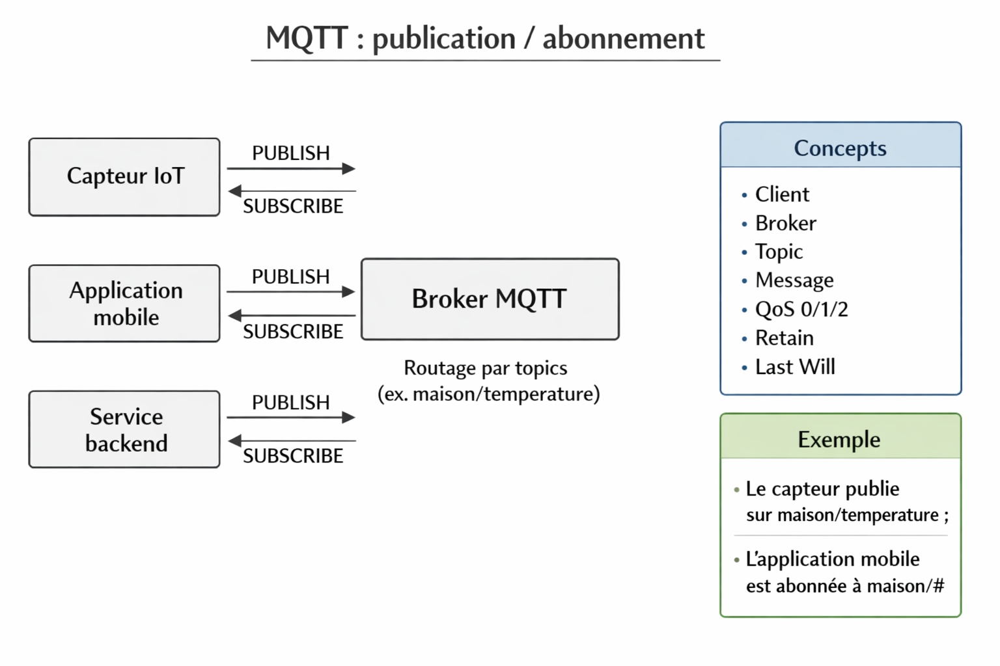

# Protocole MQTT

## Introduction

**MQTT** (Message Queuing Telemetry Transport) est le protocole de messagerie le plus couramment utilisé pour l'Internet des Objets (IoT). C'est un protocole de transport de messagerie **client-serveur basé sur le modèle publication/abonnement** (publish/subscribe), fonctionnant sur TCP/IP.

MQTT a été créé avec un objectif principal : **envoyer de petites quantités de données sur des réseaux peu fiables avec une bande passante limitée et une connectivité intermittente**. Le protocole est léger, ouvert, simple et conçu pour être facile à implémenter.

### Caractéristiques principales

| Avantage | Description |
|----------|-------------|
| Ressources minimales | Petit empreinte de code, faible surcharge, faible consommation d'énergie |
| Messagerie bidirectionnelle | Communication bidirectionnelle entre appareil et cloud |
| Scalabilité | Peut supporter des millions d'appareils connectés |
| Livraison fiable | Support de 3 niveaux de QoS |
| Réseaux peu fiables | Fonctionne bien sur les réseaux instables |
| Sécurité | Compatible avec TLS/SSL et protocoles d'authentification |

### Liens utiles

- [mqtt.org](https://mqtt.org/)
- [MQTT Wiki](https://github.com/mqtt/mqtt.org/wiki)
- [fr.wikipedia.org/wiki/MQTT](https://fr.wikipedia.org/wiki/MQTT)
- [Documentation Mosquitto](https://mosquitto.org/documentation/)
- Présentation par HiveMQ : [Part 1](https://www.hivemq.com/blog/mqtt-essentials-part-1-introducing-mqtt/) - [Part 2](https://www.hivemq.com/blog/mqtt-essentials-part2-publish-subscribe/) - [Part 3](https://www.hivemq.com/blog/mqtt-essentials-part-3-client-broker-connection-establishment/) - [Part 4](https://www.hivemq.com/blog/mqtt-essentials-part-4-mqtt-publish-subscribe-unsubscribe/) - [Part 5](https://www.hivemq.com/blog/mqtt-essentials-part-5-mqtt-topics-best-practices/)

---

## Architecture MQTT : Modèle Publish/Subscribe



### Concepts fondamentaux

MQTT fonctionne selon un modèle publication/abonnement décentralisé avec trois composants :

- **Éditeur (Publisher)** : Envoie des messages sur des sujets (topics) spécifiques
- **Abonné (Subscriber)** : Reçoit les messages des sujets auxquels il s'est abonné
- **Courtier (Broker)** : Élément central qui filtre tous les messages entrants et les distribue aux abonnés

L'éditeur et l'abonné sont **découplés** l'un de l'autre : les publishers n'ont pas besoin de connaître les subscribers et vice versa. Le broker gère toute la communication.

### Gestion des connexions

- Si un subscriber est déconnecté, le broker met en mémoire tampon les messages
- Les messages sont transmis au subscriber lors de sa reconnexion (session persistante)
- Un client peut s'abonner à plusieurs sujets à la fois
- Un sujet peut avoir plusieurs abonnés

---

## Topics (Sujets)

Les topics sont des chaînes de caractères hiérarchiques utilisant `/` comme séparateur, similaire à un chemin de fichier.

Exemple de hiérarchie :
```
capteurs/temperature/salon
capteurs/temperature/chambre
capteurs/humidite/salon
capteurs/humidite/chambre
```

### Wildcards (Jokers)

| Symbole | Type | Description | Exemple |
|---------|------|-------------|---------|
| `+` | Niveau unique | Correspond à un seul niveau dans un sujet | `a/+/c` correspond à `a/b/c` et `a/x/c` |
| `#` | Multi-niveaux | Correspond à tous les niveaux suivants | `a/#` correspond à `a/b`, `a/b/c`, etc. |

---

## Qualité de Service (QoS)

MQTT offre trois niveaux de QoS pour garantir la fiabilité de la messagerie :

| Niveau | Nom | Garantie | Description |
|--------|-----|----------|-------------|
| **QoS 0** | At most once | Au plus une fois | Le message est envoyé une seule fois, sans garantie de réception. Aucun accusé de réception. Adapté aux connexions fiables. |
| **QoS 1** | At least once | Au moins une fois | Garantit la livraison mais le message peut être reçu plusieurs fois. Le broker attend un accusé de réception et renvoie si nécessaire. |
| **QoS 2** | Exactly once | Exactement une fois | Livraison unique garantie via un handshake en quatre étapes. Plus lent mais plus sûr. Recommandé quand la duplication a des conséquences négatives. |

Le choix du niveau de QoS dépend des besoins de l'application, de la fiabilité du réseau et de la tolérance aux duplicatas ou aux pertes de messages.

---

## Commandes MQTT (Paquets du protocole)

### Structure générale des paquets

Tous les paquets MQTT suivent une structure commune :

| Composant | Présence | Description |
|-----------|----------|-------------|
| **Fixed Header** | Toujours | Type de paquet, drapeaux et longueur restante |
| **Variable Header** | Conditionnelle | Métadonnées spécifiques au type de paquet |
| **Payload** | Conditionnelle | Données spécifiques au type de paquet |

Taille : minimum **2 bytes**, maximum **256 MB**.

---

### CONNECT

Établir une connexion initiale entre le client et le courtier MQTT. C'est le premier paquet envoyé après l'établissement de la connexion TCP. Un client ne peut envoyer qu'un seul paquet CONNECT.

| Paramètre | Type | Optionnel | Description | Exemple |
|-----------|------|-----------|-------------|---------|
| clientId | Chaîne | Non | Identifiant unique du client | "client-1" |
| cleanSession | Booléen | Non | Indique si la session doit être réinitialisée | true |
| username | Chaîne | Oui | Nom d'utilisateur pour l'authentification | "hans" |
| password | Chaîne | Oui | Mot de passe pour l'authentification | "letmein" |
| lastWillTopic | Chaîne | Oui | Sujet du message de dernière volonté | "/hans/will" |
| lastWillQos | Entier | Oui | Niveau QoS du message de dernière volonté | 2 |
| lastWillMessage | Chaîne | Oui | Contenu du message de dernière volonté | "unexpected exit" |
| lastWillRetain | Booléen | Oui | Conserver le message de dernière volonté | false |
| keepAlive | Entier | Non | Intervalle de maintien de la connexion (secondes) | 60 |

---

### PUBLISH

Publier un message sur un sujet spécifique. Ce paquet transmet les données d'application du client vers le courtier ou du courtier vers les abonnés.

| Paramètre | Type | Optionnel | Description | Exemple |
|-----------|------|-----------|-------------|---------|
| packetId | Entier | Conditionnel | Identifiant du paquet (toujours 0 pour QoS 0) | 4314 |
| topicName | Chaîne | Non | Sujet sur lequel publier | "topic/1" |
| qos | Entier | Non | Niveau de qualité de service (0, 1 ou 2) | 1 |
| retainFlag | Booléen | Non | Conserver le message sur le courtier | false |
| payload | Données | Non | Contenu du message | "temperature:32.5" |
| dupFlag | Booléen | Non | Indique si ce paquet est un doublon | false |

---

### SUBSCRIBE

S'abonner à un ou plusieurs sujets pour recevoir les messages publiés.

| Paramètre | Type | Optionnel | Description | Exemple |
|-----------|------|-----------|-------------|---------|
| packetId | Entier | Non | Identifiant unique du paquet | 4312 |
| qos1 | Entier | Non | Niveau QoS pour le premier sujet | 1 |
| topic1 | Chaîne | Non | Premier sujet | "topic/1" |
| qos2 | Entier | Non | Niveau QoS pour le deuxième sujet | 0 |
| topic2 | Chaîne | Non | Deuxième sujet | "topic/2" |

---

### SUBACK

Accusé de réception du courtier confirmant l'abonnement aux sujets demandés.

| Paramètre | Type | Description | Exemple |
|-----------|------|-------------|---------|
| packetId | Entier | Identifiant du paquet SUBSCRIBE | 4313 |
| returnCode 1 | Entier | Code de retour pour le premier sujet | 2 |
| returnCode 2 | Entier | Code de retour pour le deuxième sujet | 0 |

---

### UNSUBSCRIBE

Se désabonner d'un ou plusieurs sujets.

| Paramètre | Type | Description | Exemple |
|-----------|------|-------------|---------|
| packetId | Entier | Identifiant unique du paquet | 4315 |
| topic1 | Chaîne | Premier sujet à désabonner | "topic/1" |
| topic2 | Chaîne | Deuxième sujet à désabonner | "topic/2" |

---

### UNSUBACK

Accusé de réception du courtier confirmant le désabonnement.

| Paramètre | Type | Description | Exemple |
|-----------|------|-------------|---------|
| packetId | Entier | Identifiant du paquet UNSUBSCRIBE | 4316 |

---

### PINGREQ

Vérifier que la connexion avec le courtier est toujours active. Envoyé périodiquement pour maintenir la connexion. Ce paquet ne contient que le Fixed Header, sans paramètres supplémentaires.

---

### DISCONNECT

Terminer la connexion avec le courtier de manière propre. Ce paquet ne contient que le Fixed Header, sans paramètres supplémentaires.

---

## Mise en pratique

### Installation du broker Mosquitto

```bash
sudo apt-get install mosquitto
```

Vérification :
```bash
mosquitto -v
```

Les ports d'écoute du broker Mosquitto :

| Port | Description |
|------|-------------|
| 1883 | MQTT, non chiffré |
| 8883 | MQTT, chiffré |
| 8884 | MQTT, chiffré, certificat client requis |
| 8080 | MQTT over WebSockets, non chiffré |
| 8081 | MQTT over WebSockets, chiffré |

### Contrôle du service

```bash
systemctl status mosquitto
```

Fichier de configuration : `/etc/mosquitto/mosquitto.conf`
Fichier de log : `/var/log/mosquitto/mosquitto.log`

### Installation des clients

```bash
sudo apt-get install mosquitto-clients
```

Deux clients CLI sont disponibles : `mosquitto_pub` et `mosquitto_sub`.

### Options de base

| Option | Description |
|--------|-------------|
| `-h` | Hostname (par défaut localhost) |
| `-t` | Le topic (sujet) |
| `-m` | Le message |
| `-v` | Mode verbose |

### Exemples d'utilisation

**Échange simple de messages :**

Terminal subscriber :
```bash
mosquitto_sub -t greeting
```

Terminal publisher :
```bash
mosquitto_pub -t greeting -m "Hello World !"
```

**Simulation de capteurs de température :**

Terminal subscriber :
```bash
mosquitto_sub -h 192.168.52.12 -t "capteurs/#" -v
```

Terminal publisher :
```bash
mosquitto_pub -h 192.168.52.12 -t capteurs/temperature/salon -m 23.0
mosquitto_pub -h 192.168.52.12 -t capteurs/temperature/chambre -m 21.0
```

Les valeurs peuvent être de type numérique ou du texte (au format JSON par exemple).

---

## Programmation MQTT

### En C

- [Exemples Mosquitto en C](https://github.com/eclipse/mosquitto/tree/master/examples)
- [cJSON : lecture/écriture JSON en C](https://www.geeksforgeeks.org/cjson-json-file-write-read-modify-in-c/)
- [Bibliothèque cJSON](https://github.com/DaveGamble/cJSON)

### En Python

- [Recevoir des messages avec paho-mqtt](http://www.steves-internet-guide.com/receiving-messages-mqtt-python-client/)
- [Callbacks MQTT en Python](http://www.steves-internet-guide.com/mqtt-python-callbacks/)

---

## Sécurité

MQTT offre plusieurs mécanismes de sécurité :

- Support du **Transport Layer Security (TLS)** et **Secure Sockets Layer (SSL)**
- Chiffrement des données en transit
- Authentification et autorisation via identifiants utilisateur/mot de passe ou certificats clients

---

## Opérations fondamentales MQTT (résumé)

| Opération | Description |
|-----------|-------------|
| **Connect** | Établir une connexion avec le courtier |
| **Publish** | Publier un message sur un sujet |
| **Subscribe** | S'abonner à un sujet pour recevoir des messages |
| **Unsubscribe** | Se désabonner d'un sujet |
| **Ping** | Vérifier la connexion avec le courtier |
| **Disconnect** | Terminer proprement la connexion |
